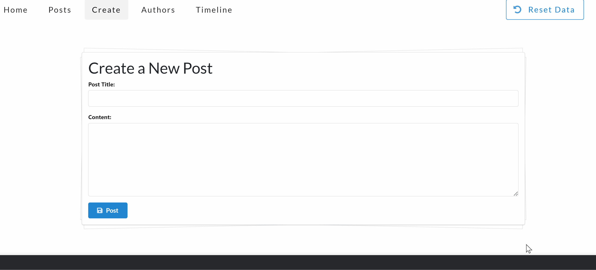

# LatinBlogPortfolio

A demo site of a Latin blog where users can create, delete, and search for posts. This site uses a mock API, so some functionality has been emulated. If any irrecoverable errors occur, please clear your cookies. Built with React, this portfolio emphasizes accessibility, responsiveness, minimalism, and aesthetics.

## Table of Contents

- [Demo](#demo)
- [Features](#features)
- [Technologies Used](#technologies-used)
- [Getting Started](#getting-started)
  - [Prerequisites](#prerequisites)
  - [Installation](#installation)
- [Usage](#usage)
- [Contributing](#contributing)
- [License](#license)
- [Contact](#contact)

## Demo

Check out the live demo of the LatinBlogPortfolio hosted on [GitHub Pages](https://Thrillseeker419.github.io/LatinBlogPortfolio/).


## Features

- **Create Posts:** Users can compose and publish new blog posts.
- **Delete Posts:** Remove unwanted or outdated posts.
- **Search Functionality:** Easily find posts using the search bar.
- **Responsive Design:** Optimized for desktops, tablets, and mobile devices.
- **Accessible Interface:** Designed following accessibility best practices.
- **Mock API Integration:** Simulates backend interactions for a seamless user experience.

## Technologies Used

- **Frontend:**
  - [React](https://reactjs.org/) - JavaScript library for building user interfaces.
  - [CSS3](https://developer.mozilla.org/en-US/docs/Web/CSS) - Styling and layout.
  - [HTML5](https://developer.mozilla.org/en-US/docs/Web/HTML) - Markup language.
- **Tools & Services:**
  - [GitHub Pages](https://pages.github.com/) - Hosting the portfolio website.
  - [Mock Service Worker (MSW)](https://mswjs.io/) - Mocking API calls for development.

## Getting Started

To download and run the project on your local machine, follow these steps:

### Prerequisites

- **Node.js** (v16 or later)
- **npm** (v7 or later)

### Installation

1. **Clone the repository:**

    ```bash
    git clone https://github.com/Thrillseeker419/LatinBlogPortfolio.git
    ```

2. **Navigate to the project directory:**

    ```bash
    cd LatinBlogPortfolio/react-app
    ```

3. **Install dependencies:**

    ```bash
    npm install
    ```

4. **Start the development server:**

    ```bash
    npm start
    ```

5. **Open the application in your browser:**

    Navigate to [http://localhost:3000](http://localhost:3000) to view the project.

## Usage

Once the application is running, you can:

- **Create a Post:**
  - Click on the "New Post" button.
  - Fill in the title and content fields.
  - Submit to add the post to the blog.

- **Delete a Post:**
  - Click the "Delete" button on the desired post.
  - Confirm the deletion to remove the post.

- **Search for Posts:**
  - Use the search bar at the top to find posts by keywords.



## Contributing

Contributions are not currently welcome! 

## License

This project is licensed under the [MIT License](LICENSE).

## Contact

GitHub: [Thrillseeker419](https://github.com/Thrillseeker419)
